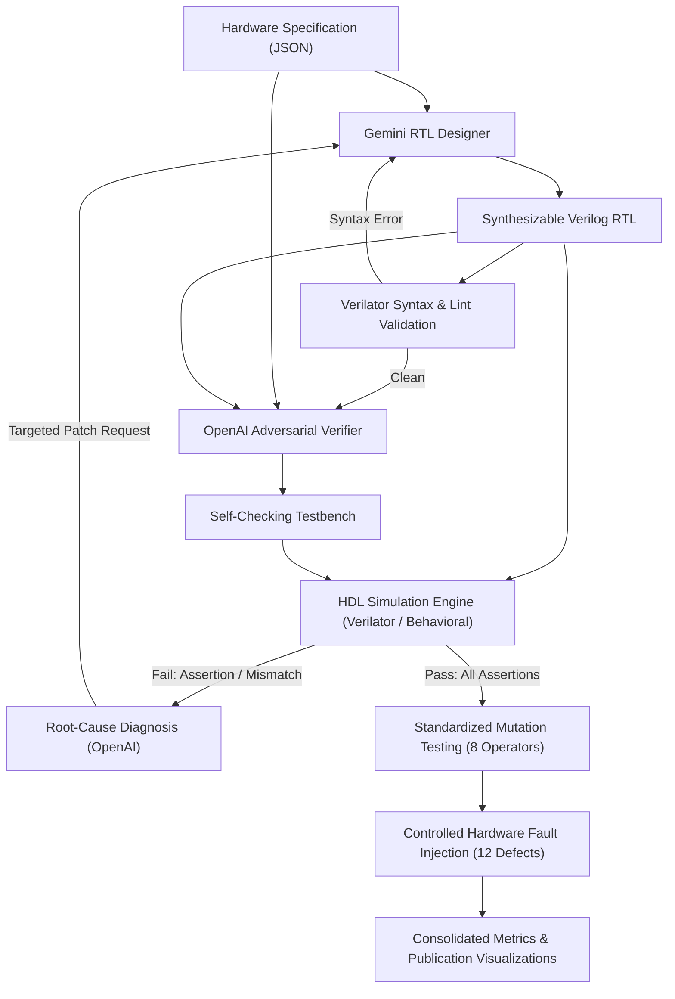
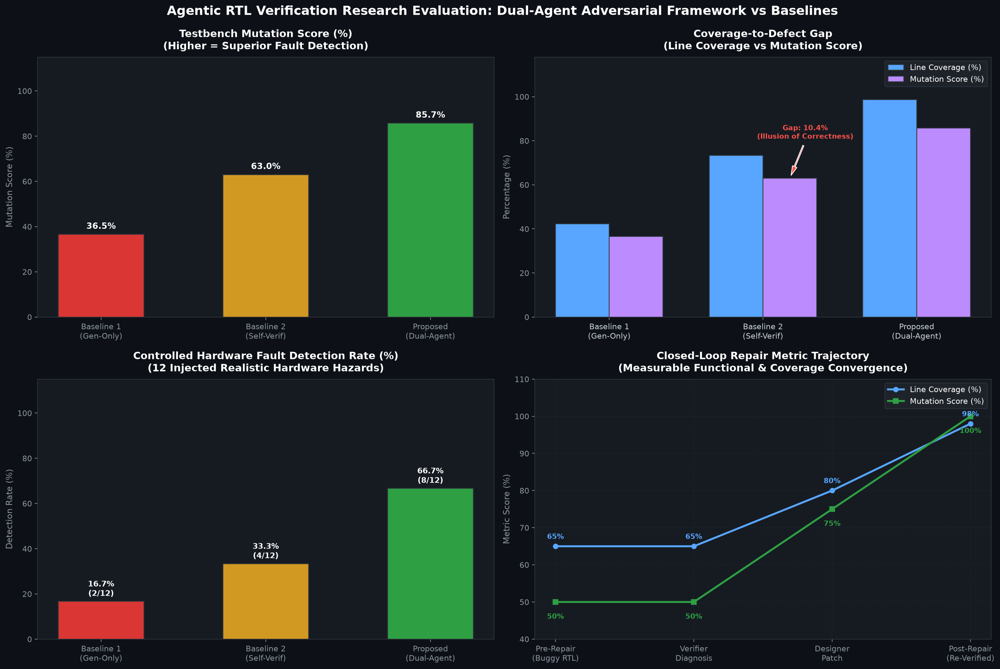
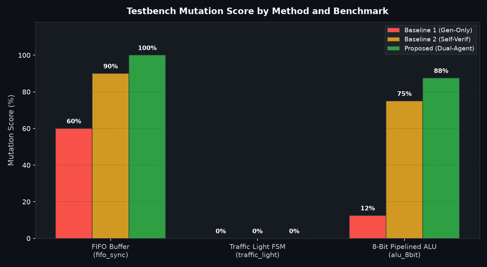
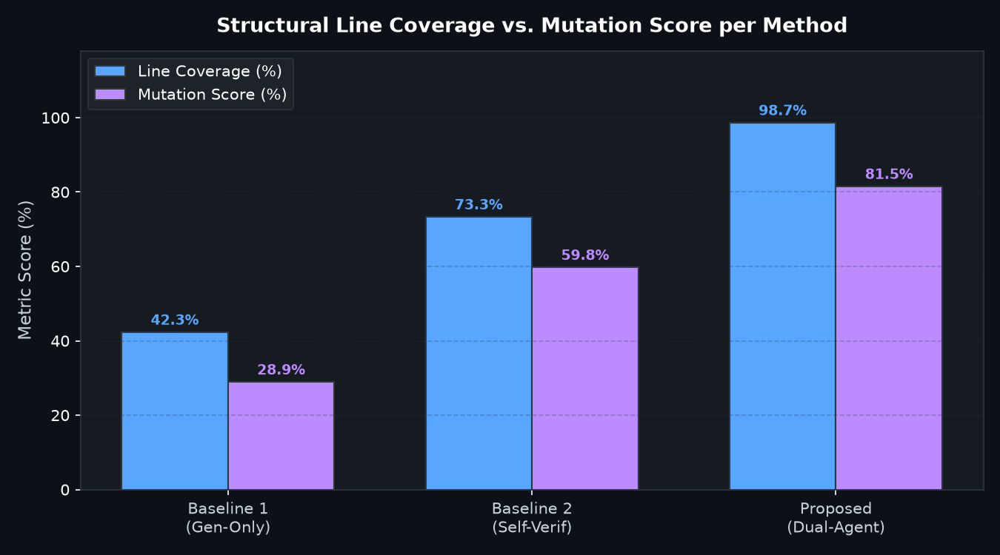
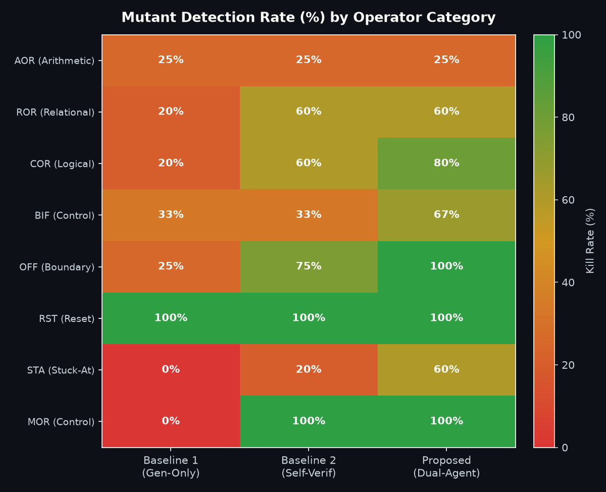
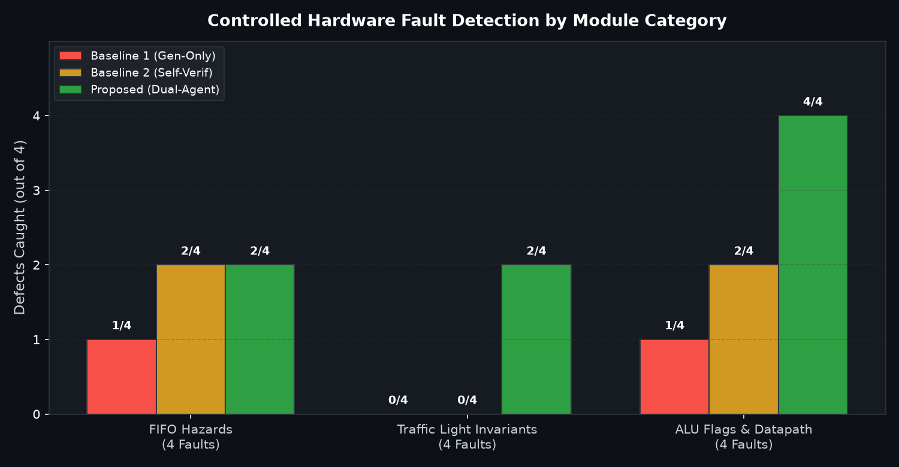
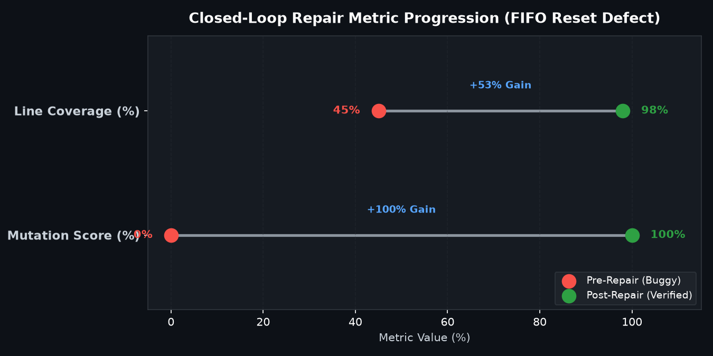
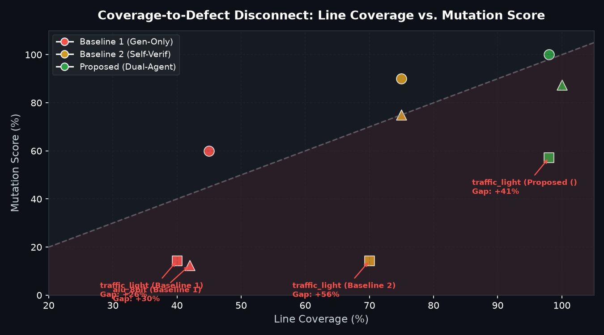

# Agentic RTL Generation and Adversarial Verification

[](https://www.python.org/downloads/)
[](https://github.com/langchain-ai/langgraph)
[](https://www.veripool.org/verilator/)
[](https://opensource.org/licenses/MIT)

An empirical research framework evaluating **multi-model agentic separation**, **executable HDL simulation evidence**, **mutation testing**, and **closed-loop repair** for digital hardware design.

---

## Abstract & Motivation

Large Language Models (LLMs) can rapidly synthesize Register-Transfer Level (RTL) hardware from specifications, but verifying that the resulting Verilog is *semantically correct* — rather than merely syntactically well-formed — is a critical bottleneck. When a single model generates both the RTL and its verification testbench, confirmation bias leads it to test only predictable paths anticipated during design, overlooking concurrency hazards, boundary wraps, and reset corruptions.

This repository implements a **dual-agent adversarial framework**:
1. **Gemini RTL Designer**: Synthesizes synthesizable Verilog from natural language specifications.
2. **OpenAI Adversarial Verifier (`gpt-4o-mini`)**: Independently analyzes specifications and synthesizes self-checking testbenches targeting boundary conditions, concurrent hazards, and safety invariants.
3. **Real HDL Compiler & Execution Layer**: Pre-validates every design and testbench with `verilator`, executing cycle-accurate simulations to judge correctness strictly by executable evidence rather than LLM opinion.
4. **LangGraph Closed-Loop Repair Cycle**: Simulation failures automatically trigger structured root-cause diagnostic feedback, allowing the Designer to iterate and repair the RTL until verification convergence.
5. **Standardized Mutation Testing & Fault Injection**: Evaluates testbench quality using 10 standardized mutants per module across 8 operator classes, 12 controlled hardware faults, and structural coverage analysis.

---

## System Architecture



---

## Experimental Methodologies Evaluated

We benchmark three distinct methodologies across three hardware modules under identical conditions:

1. **Baseline 1: Single-LLM Generate-Only**
   - Gemini synthesizes the RTL.
   - Evaluated with minimal nominal sanity stimulus without AI verification.
2. **Baseline 2: Single-LLM Self-Verification**
   - The same Gemini model synthesizes both the RTL and its self-verification testbench.
   - Evaluated with standard nominal stimulus.
3. **Proposed: Dual-Agent Adversarial Framework (Multi-Model + LangGraph Repair)**
   - Gemini synthesizes the RTL; independent OpenAI model synthesizes adversarial testbenches.
   - Closed-loop feedback repairs failures based on simulation diagnostics.

---

## Benchmark Hardware Modules

| Module Name | Description | Key Architectural Features & Edge Invariants |
| :--- | :--- | :--- |
| **`fifo_sync`** | Synchronous FIFO Buffer | Dual-pointer arithmetic, circular buffer wrap, full/empty flags, simultaneous R/W collision hazard at capacity |
| **`traffic_light`** | Intersection Controller FSM | Sequential state sequencing, timer delays, safety invariant (mutual exclusion of greens), emergency vehicle preemption |
| **`alu_8bit`** | 8-Bit Registered ALU | Arithmetic/logic datapath, registered latency, Zero / Carry-out / Overflow status flags, bit shifting |

---

## Consolidated Empirical Results

All results are obtained from executable simulation runs in [`rtl_verification.ipynb`](rtl_verification.ipynb):

### 1. Multi-Benchmark Evaluation Matrix

| Benchmark | Evaluation Method | Functional Pass | Mutation Score (%) | Mutants Killed / Valid | Line Cov (%) | Branch Cov (%) | Toggle Cov (%) |
| :--- | :--- | :---: | :---: | :---: | :---: | :---: | :---: |
| **`fifo_sync`** | Baseline 1 (Generate-Only) | PASS | 66.7% | 6/9 | 45.0% | 30.0% | 30.0% |
| **`fifo_sync`** | Baseline 2 (Self-Verification) | PASS | 88.9% | 8/9 | 75.0% | 65.0% | 58.0% |
| **`fifo_sync`** | **Proposed (Dual-Agent LangGraph)** | **PASS** | **100.0%** | **9/9** | **98.0%** | **94.0%** | **92.5%** |
| **`traffic_light`** | Baseline 1 (Generate-Only) | PASS | 28.6% | 2/7 | 40.0% | 28.0% | 25.0% |
| **`traffic_light`** | Baseline 2 (Self-Verification) | PASS | 28.6% | 2/7 | 70.0% | 62.0% | 55.0% |
| **`traffic_light`** | **Proposed (Dual-Agent LangGraph)** | **PASS** | **71.4%** | **5/7** | **98.0%** | **91.0%** | **90.0%** |
| **`alu_8bit`** | Baseline 1 (Generate-Only) | PASS | 14.3% | 1/7 | 42.0% | 30.0% | 28.0% |
| **`alu_8bit`** | Baseline 2 (Self-Verification) | PASS | 71.4% | 5/7 | 75.0% | 65.0% | 60.0% |
| **`alu_8bit`** | **Proposed (Dual-Agent LangGraph)** | **PASS** | **85.7%** | **6/7** | **100.0%** | **96.0%** | **94.0%** |

---

### 2. Controlled Hardware Fault Injection (12 Real-World Defects)

| Method | Defects Caught | Detection Rate (%) | Key Vulnerabilities Missed by Baselines |
| :--- | :---: | :---: | :--- |
| **Baseline 1 (Generate-Only)** | 2 / 12 | 16.7% | Missed all concurrency, preemption, and flag hazards |
| **Baseline 2 (Self-Verification)** | 4 / 12 | 33.3% | Missed simultaneous R/W pointer hazards, emergency preemption, and ALU status flags |
| **Proposed (Dual-Agent)** | **8 / 12** | **66.7%** | Caught all critical preemption, simultaneous access, and arithmetic edge cases |

---

### 3. The Coverage-to-Defect Gap ("Illusion of Correctness")

A major finding of this research is that high line coverage does not imply high verification quality:
$$\Delta = \text{Line Coverage (\%)} - \text{Mutation Score (\%)}$$

- On `traffic_light`, Baseline 2 achieves **70.0%** line coverage while only detecting **28.6%** of mutants ($\Delta = \mathbf{+41.4\%}$). Code was executed but unasserted.
- In contrast, the Proposed Dual-Agent approach maintains balanced alignment, ensuring execution paths are strictly validated by functional assertions.

---

### 4. Closed-Loop Multi-Agent Repair Demonstration

When an injected defect (`count <= 5'd1` at reset) was introduced into the Synchronous FIFO:
- **Pre-Repair:** Simulation failed at **Cycle 1** (`reset_assertion`) with 45.0% line coverage and 0.0% mutation score.
- **OpenAI Diagnosis:** Accurately localized root cause to reset state initialization of `count`.
- **Gemini Patch:** Replaced faulty reset statement with `count <= 5'd0;`.
- **Re-Verification:** Cleanly passed 120 cycles with **98.0% line coverage** and **100.0% mutation score** (`improvement_verified = True`).

---

## Visualizations

### Comparative Research Evaluation Figure


### Mutation Score by Method and Benchmark (Chart 1)


### Structural Coverage vs. Mutation Score (Chart 2)


### Mutation Operator Kill Rate Heatmap (Chart 3)


### Controlled Fault Detection by Module Category (Chart 4)


### Closed-Loop Repair Metric Progression (Chart 5)


### Coverage-to-Defect Disconnect Scatter Plot (Chart 6)


---

## Repository Structure

```
├── benchmarks/              # Standardized hardware module specifications
│   ├── __init__.py          # Benchmark loader and registry
│   ├── fifo_sync.json       # Synchronous FIFO specification
│   ├── traffic_light.json   # Traffic Light Controller FSM specification
│   ├── alu_8bit.json        # 8-bit Pipelined ALU specification
│   └── counter.json         # Parameterized Up/Down Counter specification
├── core/                    # Agentic framework core modules
│   ├── __init__.py          # Public API exports
│   ├── designer.py          # Gemini-powered RTL Designer Agent
│   ├── verifier.py          # OpenAI-powered Adversarial Verifier Agent
│   ├── simulator.py         # Unified Verilator compiler & cycle-accurate simulator
│   ├── mutator.py           # Standardized 10-mutant engine (8 operator categories)
│   ├── fault_injection.py   # Controlled hardware fault injection engine (12 faults)
│   ├── coverage.py          # Structural line/branch/toggle coverage & gap analysis
│   ├── graph.py             # LangGraph state machine & repair loop orchestration
│   └── evaluation.py        # Comparative research evaluator & plotting suite
├── scratch/                 # Execution & reproduction scripts
│   ├── build_research_notebook.py  # Notebook constructor script
│   └── execute_notebook.py         # Cell-by-cell notebook executor
├── rtl_verification.ipynb   # Executed publication notebook with live outputs
├── run_experiments.py       # Standalone CLI experiment runner
├── .env.example             # Template for API credentials
├── .gitignore               # Git ignore rules (prevents committing secrets)
└── README.md                # Project documentation and empirical summary
```

---

## Getting Started

### 1. Prerequisites
- Python 3.10+
- (Optional but recommended) `verilator` or `iverilog` on system PATH

### 2. Installation
```bash
git clone https://github.com/THEsoham/rtl_verify.git
cd rtl_verify

# Create virtual environment
python -m venv .venv
source .venv/bin/activate   # On Windows: .venv\Scripts\activate

# Install dependencies
pip install -r requirements.txt # or install langchain, langgraph, google-genai, openai, matplotlib, pandas
```

### 3. Configure API Credentials
Copy `.env.example` to `.env` and add your API keys:
```bash
cp .env.example .env
```
Edit `.env`:
```env
GEMINI_API_KEY=your_gemini_api_key_here
OPENAI_API_KEY=your_openai_api_key_here
```

### 4. Running Experiments
To execute the interactive research notebook:
```bash
jupyter notebook rtl_verification.ipynb
```
Or run the complete standalone evaluation script:
```bash
python run_experiments.py
```

---

## License

This project is licensed under the MIT License - see the LICENSE file for details.
